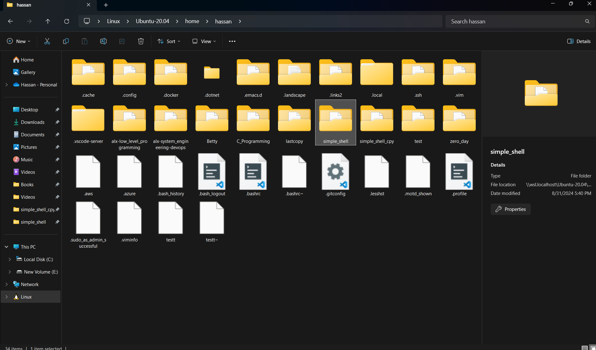
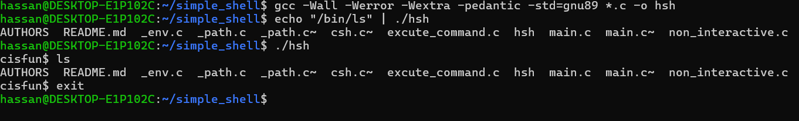

## Shell
> the shell is a program that takes commands from the   keyboard and gives them to the operating system to perform.  In the old days, it was the only user interface available on a Unix-like system such as Linux.

### How to interact with computers


Nowadays, There're two ways to interact with computers:

1. Graphical shells
2. Command Line shells

### Graphical shells
Graphical shells provide means for manipulating programs based on the graphical user interface (GUI), by allowing for operations such as opening, closing, moving, and resizing windows, as well as switching focus between windows. Window OS or Ubuntu OS can be considered as a good example which provides GUI to the user for interacting with the program. Users do not need to type in commands for every action. A typical GUI in the Ubuntu system.

<div align="center">

</div>

### Command line shells
Command Line Shell
Shell can be accessed by users using a command line interface. A special program called Terminal in Linux/macOS, or Command Prompt in Windows OS is provided to type in the human-readable commands such as “cat”, “ls” etc. and then it is being executed. The result is then displayed on the terminal to the user.

<div align="center">

</div>

### What this shell does support
* Ineractive mode 
* Non-ineractive mode
* Single command
* Handle arguments like options
* Custom built-in exit, cd ,and env functions
* handle realtive and absloute paths
* hand Path varible

### What this shell doesn't support
* special characters like " ' ? $ 
* redirections << >> > < and pipeline |

### Content of project files

```
main.c ------------------------------ Entery of the program
shell.h ----------------------------- Header of the program
```
Helper files

```
shell.c ------------------ Handle interactive mode in shell
non_interactive.c ------------- Handle non-interactive mode
excute_command.c --------------- Execute commands from user
_env.c ---------------- prints value of envionment variable
_path.c ------------------------------ Handle $PATH varible
AUTHORS ----------------------- Contributors of the project
README.md -------------------- Documentation of the project
``` 
### How to install this shell

```
(your_terminal)$ git clone git@github.com:hassanah391/simple_shell.git
(your_terminal)$ cd simple_shell
(your_terminal)$ gcc -Wall -Werror -Wextra -pedantic -Wno-format *.c -o simple_shell
```
**Non-Interactive Mode**
```
echo "ls -l" | ./simple_shell
```
**Interactive Mode***
Activate the shell
```
(your_terminal)$ ./simple_shell
cisfun$
```
Sample Usage
```
cisfun$ ls -al
total 4
-rw-rw-r-- 1 vagrant vagrant   234 Mar 28 19:32 file1.c
-rw-rw-r-- 1 vagrant vagrant    69 Mar 28 19:32 file2.c
cisfun$ echo "This is a pretty cool!"
This is pretty cool!
```
Stop and return to your original shell
```
cisfun$ exit
(your_terminal)$
```

